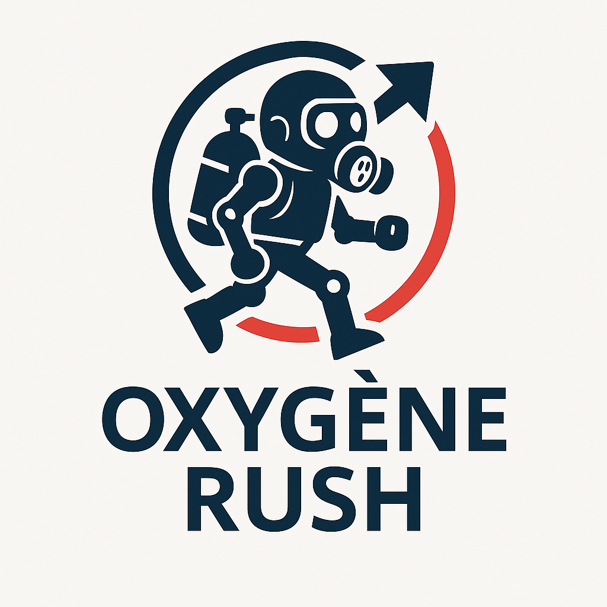

GROUPE    YATCHOU SARA 

ESCAPE BOT

## SUJET 
Dans Escape Bot, tu incarnes un petit robot égaré dans une station spatiale abandonnée. Ton objectif est de collecter des batteries pour survivre, tout en évitant les pièges mortels qui hantent les couloirs désolés de la station. Le temps est compté : ton oxygène diminue à chaque seconde…

## Type de jeu

Genre : Plateforme / Arcade

Vue : 2D latérale

Style graphique : Minimaliste futuriste, ambiance sombre et métallique

## Objectifs du joueur

Collecter les batteries pour prolonger ton autonomie.

Éviter les pièges (piques, lasers, robots défectueux, etc.).

Atteindre la sortie avant la fin de l’oxygène.

## Mécaniques de jeu

Compte à rebours d’oxygène visible à l’écran

Contrôle fluide du robot (saut, double saut, glissade)

Rejouabilité : niveaux générés ou modifiés aléatoirement

Système de score basé sur les batteries collectées + temps restant

## Présentation générale
Titre du jeu : Escape Bot (nom temporaire)

Genre : Plateforme / Arcade 2D

Plateformes : PC, Web, mobile

Public cible : Joueurs occasionnels, amateurs de jeux rétro/arcade

Durée moyenne d’une session : 3 à 5 minutes par niveau

## Contexte & Univers
Le joueur contrôle un robot d’exploration qui s’est réveillé seul dans une station spatiale désertée.

L’ambiance est sombre, avec des lumières clignotantes et un bruit de fond angoissant (style science-fiction rétro).

Le robot doit trouver un moyen de s’échapper avant que son oxygène ne s’épuise.

## Objectifs du jeu
Court terme : Collecter des batteries pour prolonger son autonomie.

Moyen terme : Éviter les pièges et obstacles dans chaque niveau.

Long terme : Atteindre la sortie de chaque niveau pour progresser vers la sortie finale de la station.

## Mécaniques principales
Déplacement : Gauche / Droite / Saut / Glissade

Collecte : Ramasser des batteries pour augmenter le score et le temps

Évitement : Esquiver pièges, ennemis automatisés, et zones dangereuses

Temps limité : L’oxygène s’épuise progressivement (compte à rebours visible)

## Éléments de jeu
Pièges : Piques, lasers rotatifs, sols électrifiés

Objets :

Batteries (ajoutent du temps ou des points)

Clés ou interrupteurs (débloquent certaines portes)

Niveaux : De difficulté croissante, avec thèmes visuels variés (zone médicale, hangar, centre de commandement…)

##  Style graphique & sonore
Graphismes : Pixel art ou low-poly, tons sombres et néons

Ambiance sonore : Musique synthwave lente + bruitages de station (bips, grésillements, alertes)

Effets visuels : Écrans qui clignotent, fumées, éclairs électriques